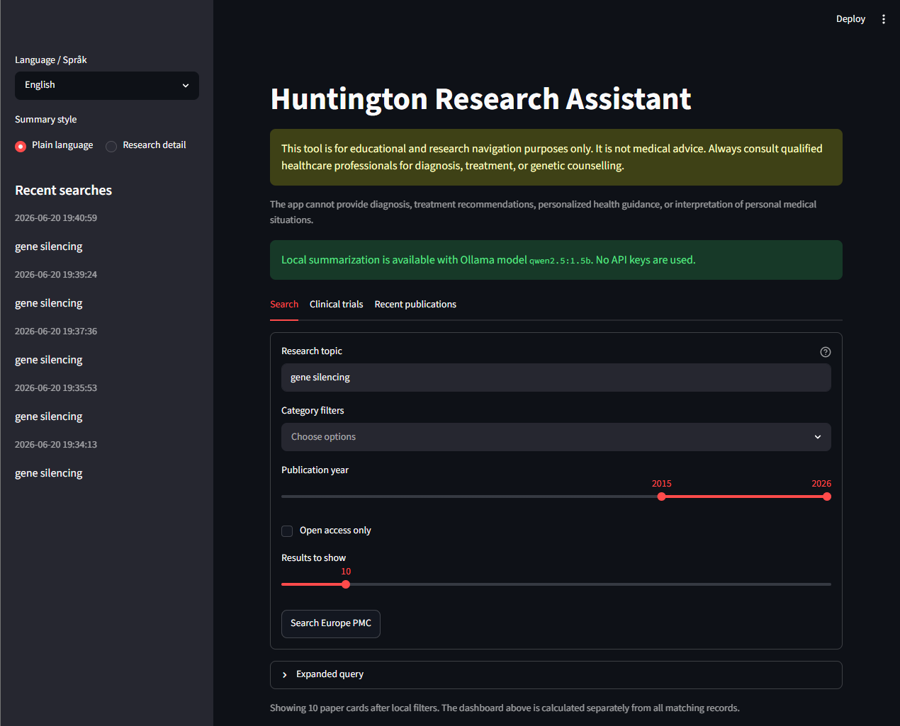
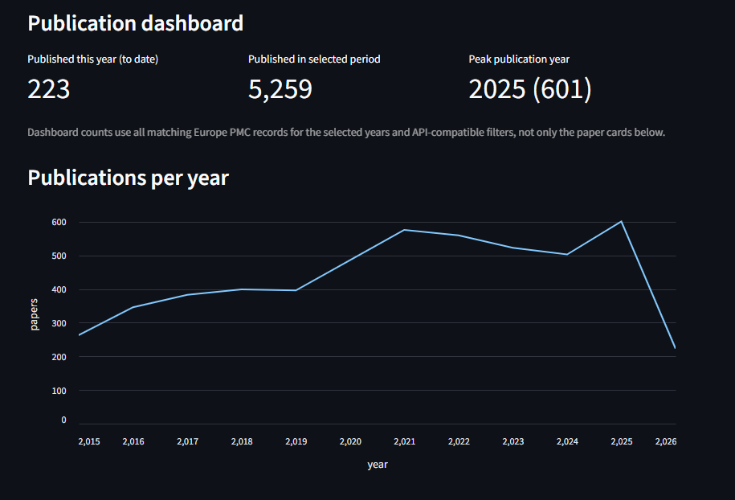
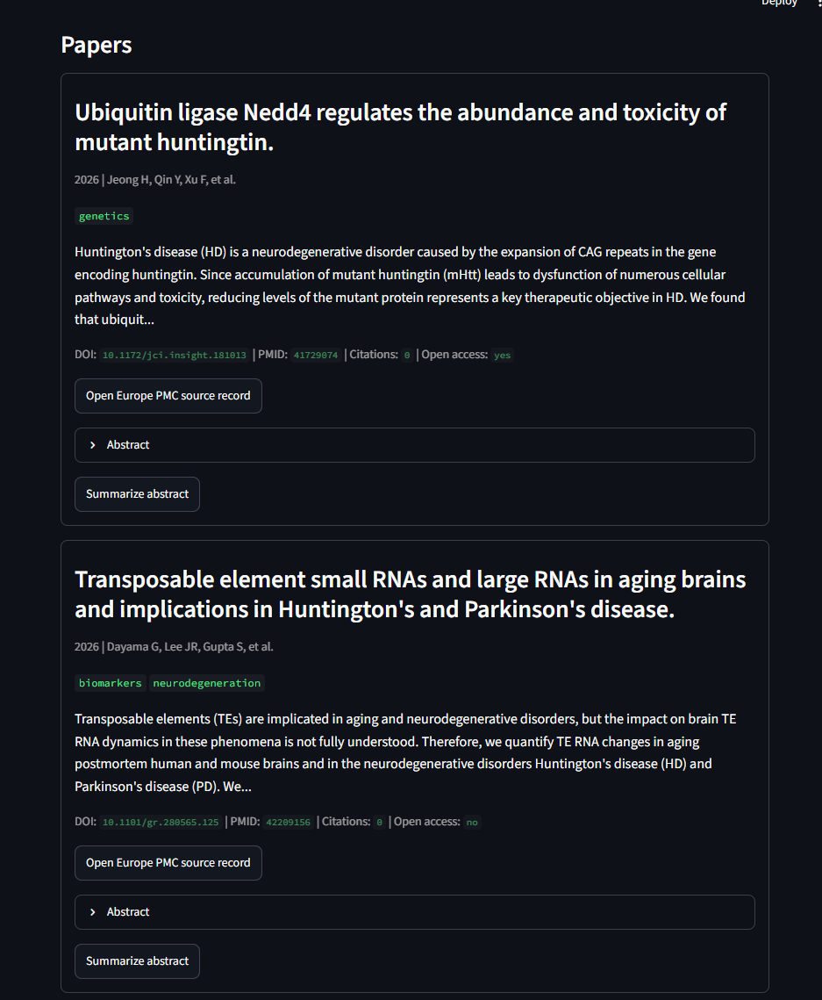
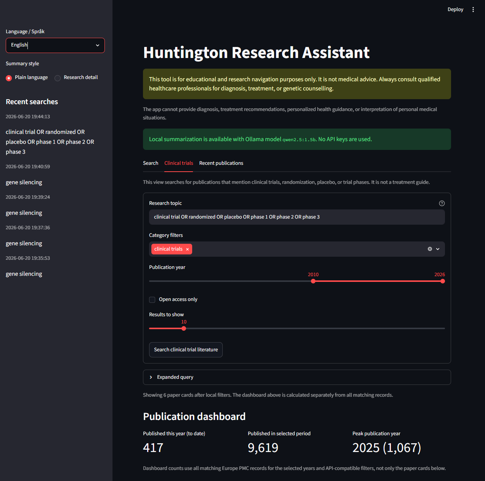
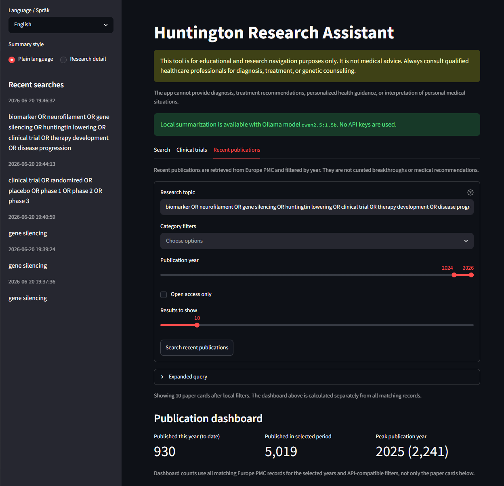

# Huntington Research Assistant

Huntington Research Assistant is a small open-source app for searching, summarizing, and navigating Huntington's disease research papers and registered clinical studies.

The current release is **v0.5.0**. See [CHANGELOG.md](CHANGELOG.md) for release highlights and known limitations.

The app uses [Europe PMC](https://europepmc.org/RestfulWebService) and [NCBI E-utilities](https://www.ncbi.nlm.nih.gov/books/NBK25501/) for publications, plus the [ClinicalTrials.gov API](https://clinicaltrials.gov/data-api/api) for registered study information. It is intended as an educational public-good project for research navigation.

> [!IMPORTANT]
> This tool is for educational and research navigation purposes only. It is not medical advice. Always consult qualified healthcare professionals for diagnosis, treatment, or genetic counselling.

## Medical Disclaimer

This tool is for educational and research navigation purposes only. It is not medical advice. Always consult qualified healthcare professionals for diagnosis, treatment, or genetic counselling.

The app does not provide diagnosis, treatment recommendations, personalized health guidance, or interpretation of personal medical situations. Do not enter personal health data.

This project is not affiliated with any medical association, including the Norwegian Huntington's disease association, at this stage.

## Features

- Search Europe PMC and PubMed for Huntington-related research papers.
- Expand simple user queries into a Huntington's disease literature context.
- Display titles, authors, year, journal, DOI, PMID, abstract snippets, source links, citation counts, and open-access flags where available.
- Display publication types and prominent Europe PMC retraction/correction notices.
- Add simple rule-based topic tags.
- Filter Europe PMC results by topic category, publication year, and open-access status.
- Browse provider-backed result pages instead of only filtering a small local batch.
- Deduplicate combined Europe PMC/PubMed results by PMID, DOI, and title/year.
- Download each paper's metadata and abstract, with direct open-access PDF links where Europe PMC provides them.
- Export the visible publication page as CSV or BibTeX with source links.
- Save papers to a local reading list and export the saved set for later review.
- Mark papers as seen and optionally hide saved or seen papers from search results.
- Compare two to five saved papers in a source-linked Evidence Explorer with conservative study-design and research-context signals.
- Export Evidence Explorer comparisons and inspect exact abstract passages used as navigation aids.
- Show a publication dashboard with yearly Europe PMC result counts, the selected-period total, and the current-year count.
- Track registered Huntington's disease studies by status, phase, country, intervention, sponsor, and registry update date.
- Export visible registered studies as CSV.
- Include a dedicated view for recent publications from the last couple of years.
- Explore source-linked genes, proteins, biomarkers, pathways, and compounds with canonical catalogue entries, exact evidence passages, and clearly labelled paper-level co-occurrences.
- Offer English and Norwegian UI labels and safety disclaimers.
- Offer English plain-language and research-detail summary modes.
- Keep experimental Norwegian generation available to developers, but disabled by default until it passes linguistic and biomedical review.
- Optionally summarize abstracts with a local Ollama model such as Qwen.
- Keep a small local SQLite cache/history.
- Continue to work without any LLM by showing retrieved papers only.
- Keep optional scientific-AI experiments isolated in a documented Digital Biology Lab that is not required by the app.

Norwegian UI labels and safety information are available. Norwegian translation of abstracts and generated summaries is planned for a later update; the current experimental implementation is disabled by default.

## Screenshots

### Search and filters



### Publication dashboard



### Search results



### Clinical-trial literature and publication trends



This literature view remains useful for finding papers about clinical trials. The app also includes a separate ClinicalTrials.gov tracker for registered-study metadata.

### Recent publications



### Optional local plain-language summary

.png>)

## Setup

Requirements:

- Python 3.11+

Create a virtual environment and install locally:

```bash
python -m venv .venv
python -m pip install -e .
```

Activate the environment first when preferred:

```powershell
# Windows PowerShell
.\.venv\Scripts\Activate.ps1
```

```bash
# macOS or Linux
source .venv/bin/activate
```

For development and tests:

```bash
python -m pip install -e ".[dev]"
python -m pytest
python -m build
```

## Automated Tests

GitHub Actions runs the test suite automatically on Python 3.11 and 3.12 whenever code is pushed or a pull request is opened. It also verifies that the package can be built. The workflow does not require Ollama, an API key, or access to personal data.

The workflow is defined in [`.github/workflows/tests.yml`](.github/workflows/tests.yml). A green check means the automated tests passed; it does not certify medical or scientific accuracy.

## Run

```bash
streamlit run app/streamlit_app.py
```

## Optional Local Summaries

Summaries are optional and run locally through [Ollama](https://ollama.com/). No cloud LLM API key is used or needed. English summaries use the small Qwen 2.5 1.5B model:

```bash
ollama pull qwen2.5:1.5b
ollama serve
```

Then run the Streamlit app normally. If Ollama is not installed, not running, or the model is not pulled, the app shows retrieved papers only.

An experimental NorMistral-based Norwegian pipeline remains in the codebase for evaluation, but is disabled in the public configuration because current testing found unreliable medical terminology and occasional meaning changes. Developer opt-in instructions are documented in [docs/NORWEGIAN_LANGUAGE.md](docs/NORWEGIAN_LANGUAGE.md).

## Environment Variables

Copy `.env.example` if you want local defaults. Environment files are optional and ignored by Git:

```powershell
Copy-Item .env.example .env
```

Supported variables:

- `OLLAMA_HOST`: local Ollama server URL. Defaults to `http://localhost:11434`.
- `OLLAMA_MODEL`: local English summary model. Defaults to `qwen2.5:1.5b`.
- `OLLAMA_NORWEGIAN_MODEL`: experimental Norwegian rendering model. Defaults to `hf.co/norallm/normistral-7b-warm-instruct:Q4_K_M`.
- `HRA_ENABLE_EXPERIMENTAL_NORWEGIAN_SUMMARIES`: developer-only opt-in for unreviewed Norwegian generation. Defaults to `false`.
- `HRA_CACHE_PATH`: optional SQLite cache path override. By default the app stores cache in the OS local app data/cache directory, outside the repo. If that location is unavailable, it falls back to the system temp directory. This avoids SQLite I/O problems in synced folders such as OneDrive.
- `HRA_EUROPE_PMC_EMAIL`: optional contact email sent in the Europe PMC user agent.
- `HRA_NCBI_EMAIL`: optional contact email sent to NCBI E-utilities. NCBI recommends including a contact email for tools that use E-utilities.
- `HRA_NCBI_API_KEY`: optional NCBI API key for higher E-utilities rate limits. It is not required for normal local use.
- `HRA_TRUST_ENV`: set to `true` only if provider requests should use system proxy environment variables. Defaults to `false` to avoid broken local proxy settings.

No API keys are required or hardcoded. If local summarization is unavailable, the app still searches literature sources.

## Data and Privacy

- Search queries are sent to the selected literature providers, such as Europe PMC and PubMed.
- Clinical-trial filter queries are sent to ClinicalTrials.gov when the tracker is used.
- Ollama summaries remain local unless `OLLAMA_HOST` is deliberately pointed elsewhere.
- Search history is stored in a local SQLite database.
- Do not enter personal health or identifying information.
- Generated summaries may be incomplete or inaccurate; always inspect the linked source paper.

## Roadmap

Near-term priorities include reviewed entity extraction, stable biomedical identifiers, Norwegian refinement, accessibility testing, stronger summary evaluation, and an optional protein-intelligence lab prototype. Optional BioNeMo, NIM, Blueprint, and protein-model experiments remain in a separate Digital Biology Lab and are not required to run the core app. Personalized medical features and automated claims about study suitability remain out of scope.

See [docs/ROADMAP.md](docs/ROADMAP.md).

Norwegian quality and accessibility are documented in [docs/NORWEGIAN_LANGUAGE.md](docs/NORWEGIAN_LANGUAGE.md) and [docs/ACCESSIBILITY.md](docs/ACCESSIBILITY.md).

The experimental research map and its strict "mentioned in" semantics are documented in [docs/KNOWLEDGE_GRAPH.md](docs/KNOWLEDGE_GRAPH.md).

The optional scientific-AI learning track is documented in [docs/DIGITAL_BIOLOGY_LAB.md](docs/DIGITAL_BIOLOGY_LAB.md) and isolated under [`labs/`](labs/README.md).

Maintainers can use [docs/RELEASE_CHECKLIST.md](docs/RELEASE_CHECKLIST.md) before creating a GitHub release.

## Contributing

Contributions are welcome. Please keep the project focused on education and research navigation, avoid collecting sensitive user data, and do not add features that provide medical advice or personalized health guidance.

Read [docs/CONTRIBUTING.md](docs/CONTRIBUTING.md) and [docs/SAFETY.md](docs/SAFETY.md) before opening a pull request.

Good first issues:

- Add more tagging keywords.
- Improve README examples.
- Add tests for Europe PMC response parsing.
- Improve Streamlit result layout.

## License

This project is released under the MIT License. See `LICENSE`.
